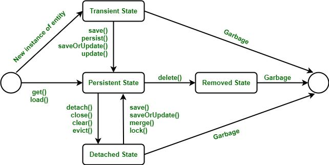

# Документация к проекту

## Запуск контейнера с PostgreSQL:

```shell
# Скачивание образа
docker pull postgres
# Запуск контейнера
docker run --name some-postgres -p 5433:5432  -e POSTGRES_PASSWORD=root -d postgres
```

====================================
------------------------------------

## Конфигурация приложения

### Зависимости

```xml

<dependencies>
    <dependency>
        <groupId>org.springframework</groupId>
        <artifactId>spring-context</artifactId>
        <version>6.2.7</version>
    </dependency>
    <dependency>
        <groupId>org.hibernate.orm</groupId>
        <artifactId>hibernate-core</artifactId>
        <version>6.6.17.Final</version>
    </dependency>
    <dependency>
        <groupId>org.postgresql</groupId>
        <artifactId>postgresql</artifactId>
        <version>42.7.6</version>
    </dependency>
</dependencies>
```

### Базовые настройки hibernate

```java

@Configuration
public class HibernateConfiguration {

    @Bean
    public SessionFactory sessionFactory() {
        org.hibernate.cfg.Configuration configuration = new org.hibernate.cfg.Configuration();

        configuration
                .addAnnotatedClass(Student.class)
                .addPackage("dev.folomkin")
                .setProperty("hibernate.connection.driver_class", "org.postgresql.Driver")
                .setProperty("hibernate.connection.url", "jdbc:postgresql://localhost:5433/postgres")
                .setProperty("hibernate.connection.username", "postgres")
                .setProperty("hibernate.connection.password", "root")
                .setProperty("hibernate.dialect", "org.hibernate.dialect.PostgreSQLDialect")
                .setProperty("hibernate.show_sql", "true")
                .setProperty("hibernate.hbm2ddl.auto", "create-drop"); //-> Создание новой/удаление старой таблиц при старте


        return configuration.buildSessionFactory();
    }
}

```

====================================
------------------------------------

## Базовые вызовы:

```java
public static void main(String[] args) {

    // -> Создание контекста
    AnnotationConfigApplicationContext context =
            new AnnotationConfigApplicationContext("dev.folomkin");

    // -> Создание фабрики сессий для получения сессии
    SessionFactory sessionFactory = context.getBean(SessionFactory.class);
    Session session = sessionFactory.openSession();

    // -> Тестовые объекты
    Student student1 = new Student("Vasya", 22);
    Student student2 = new Student("Pasha", 20);

    // -> Сохранение
    session.beginTransaction();
    session.persist(student1);
    session.persist(student2);
    session.getTransaction().commit();

    // -> Поиск
    // -> Сущность возвращается из кеша
    Student studentById1 = session.get(Student.class, 1L);
    System.out.println("Student 1: " + studentById1.toString());

    // -> JPQL запрос выполняется в базу
    Student studentById2 = session
            .createQuery("SELECT s FROM Student s WHERE s.id = :id", Student.class)
            .setParameter("id", 2L).getSingleResult();
    System.out.println("Student 2: " + studentById2.toString());

    // -> Обновление сущности
    session.beginTransaction();
    Student studentForUpdate = session.get(Student.class, 1L);
    studentForUpdate.setAge(30);
    studentForUpdate.setName("Dima");
    session.getTransaction().commit();


    // -> Удаление сущности
    session.beginTransaction();
    Student studentForDelete = session.get(Student.class, 2L);
    session.remove(studentForDelete);
    // JPQL
    session.createQuery("DELETE FROM Student s where s.id = 1").executeUpdate();
    // Нативный запрос
    session.createNativeQuery("delete from students s where s.id = 2").executeUpdate();
    session.getTransaction().commit();

    // -> Получение листа сущностей
    List<Student> allStudent = session.createQuery("select s from Student s", Student.class).list();

    // -> Поиск по полю name
    Student studentByName = session
            .createQuery("SELECT s FROM Student s WHERE s.name = :name", Student.class)
            .setParameter("name", "Pasha")
            .getSingleResult();
    System.out.println("Student name: " + studentByName.toString());

    session.beginTransaction();
    Student student3 = new Student("Pasha", 20); // -> Поле name помечено как уникальное, для проверки добавляется сущность с таким же именем
    session.persist(student3);
    session.getTransaction().commit();

    session.close();
}
```

## Жизненный цикл Entity



1. `New instance of entity`<br>
2. `Transient State`<br>
3. `Persistent State`<br>
4. `Detached State`<br>
5. `Removed State`<br>

### Комментарии к изображению

Жизненный цикл Hibernate

Hibernate — это Java-фреймворк с открытым исходным кодом, который предоставляет
возможности объектно-реляционного отображения для реляционных баз данных.
Жизненный цикл Hibernate относится к различным состояниям, через которые может
проходить сущность в сеансе Hibernate.

1. Переходное состояние(Transient state):<br>
   Когда объект впервые создается с использованием ключевого слова new, он
   находится в переходном состоянии. Это означает, что объект не связан с
   сеансом Hibernate и не отслеживается Hibernate.

2. Постоянное состояние(Persistent state):<br>
   Когда объект сохраняется или сохраняется с использованием метода
   `session.save()` или `session.persist()`, он переходит в постоянное
   состояние. Это означает, что объект теперь связан с сеансом Hibernate, и
   любые изменения, внесенные в объект, будут отслеживаться Hibernate.

3. Отсоединенное состояние(Detached state):<br>
   Когда объект удаляется из сеанса Hibernate с использованием метода
   `session.evict()/detach()`, он переходит в отсоединенное состояние. Это
   означает, что объект больше не связан с сеансом Hibernate, и любые изменения,
   внесенные в объект, не будут отслеживаться Hibernate.

4. Состояние «Удален»(Removed state):<br>
   Когда объект удаляется из базы данных с помощью метода `session.delete()`, он
   переходит в состояние «Удален». Это означает, что объект помечен для удаления
   и будет удален из базы данных после завершения транзакции.

Важно понимать жизненный цикл Hibernate, чтобы правильно управлять состоянием
сущностей в приложении Hibernate и обеспечивать согласованность и целостность
данных в базе данных.

### Подробно:

Жизненный цикл сущности (entity) в Hibernate описывает состояния, через которые
проходит объект сущности в процессе взаимодействия с базой данных. Hibernate
управляет этими состояниями, чтобы синхронизировать данные между приложением и
базой данных. Жизненный цикл включает четыре основных состояния: **Transient**,
**Persistent**, **Detached** и **Removed**. Рассмотрим каждое состояние и
переходы между ними.

### 1. **Transient (Временное состояние)**

- **Описание**: Объект создан в приложении (с помощью `new`), но ещё не связан с
  сессией Hibernate и не сохранён в базе данных. У него нет идентификатора (ID),
  связанного с записью в базе.
- **Характеристики**:
    - Не отслеживается Hibernate.
    - Не имеет связи с базой данных.
    - Изменения объекта не влияют на базу данных.
- **Пример**:

```java
void demo() {
    user.setName("John");
    User user = new User();
}

  ```

Здесь объект `user` находится в состоянии **Transient**, так как он не связан
с сессией и не сохранён.

- **Переходы**:
    - В **Persistent**: Вызов методов `session.save()`, `session.persist()` или
      `session.saveOrUpdate()` связывает объект с сессией и базой данных.
    - В **Detached**: Если объект не сохраняется, он остаётся временным, пока не
      будет собран сборщиком мусора.

### 2. **Persistent (Управляемое состояние)**

- **Описание**: Объект связан с текущей сессией Hibernate и соответствует записи
  в базе данных. Он имеет идентификатор (ID), и любые изменения объекта
  автоматически синхронизируются с базой данных при коммите транзакции (механизм
  *dirty checking*).
- **Характеристики**:
    - Отслеживается Hibernate в пределах сессии.
    - Изменения объекта автоматически сохраняются в базу при вызове
      `session.flush()` или коммите транзакции.
    - Объект связан с определённой записью в базе данных.
- **Пример**:

```java
  void demo() {
  Session session = sessionFactory.openSession();
  Transaction tx = session.beginTransaction();
  User user = new User();
  user.setName("John");
  session.save(user); // Теперь user в состоянии Persistent
  user.setName("Jane"); // Изменение отследится Hibernate
  tx.commit(); // Изменения сохранятся в базе
  session.close();
  }
  
```

- **Переходы**:
    - В **Detached**: Закрытие сессии (`session.close()`) или очистка объекта из
      сессии (`session.evict(user)`) делает объект отсоединённым.
    - В **Removed**: Вызов `session.delete(user)` переводит объект в состояние
      удаления.
    - Остаётся **Persistent**, пока сессия открыта и объект не удалён.

### 3. **Detached (Отсоединённое состояние)**

- **Описание**: Объект больше не связан с сессией Hibernate, но имеет
  идентификатор, соответствующий записи в базе данных. Изменения объекта не
  синхронизируются с базой автоматически.
- **Характеристики**:
    - Не отслеживается Hibernate.
    - Имеет идентификатор, связанный с базой данных.
    - Для синхронизации изменений нужно повторно ассоциировать объект с сессией.
- **Пример**:

```java

void demo() {
    Session session = sessionFactory.openSession();
    User user = session.get(User.class, 1L); // Persistent
    session.close(); // Теперь user в состоянии Detached
    user.setName("Alice"); // Изменения не сохраняются в базе
}

```

- **Переходы**:
    - В **Persistent**: Повторное связывание с сессией через `session.update()`,
      `session.merge()` или `session.saveOrUpdate()`.
    - В **Transient**: Если удалить идентификатор объекта (например,
      `user.setId(null)`), он становится временным, но это редкий случай.
    - В **Removed**: Если объект повторно ассоциировать с сессией и вызвать
      `session.delete()`.

### 4. **Removed (Удалённое состояние)**

- **Описание**: Объект помечен для удаления из базы данных, но всё ещё связан с
  сессией. После коммита транзакции запись удаляется из базы, и объект переходит
  в **Transient** состояние.
- **Характеристики**:
    - Отслеживается Hibernate в пределах сессии.
    - Помечен для удаления из базы данных.
    - После коммита транзакции запись удаляется.
- **Пример**:

```java

void demo(){
    Session session = sessionFactory.openSession();
    Transaction tx = session.beginTransaction();
    User user = session.get(User.class, 1L); // Persistent
    session.delete(user); // Теперь user в состоянии Removed
    tx.commit(); // Запись удаляется из базы
    session.close(); // user становится Transient
}

  ```

- **Переходы**:
    - В **Transient**: После коммита транзакции и удаления записи из базы
      данных.
    - В **Persistent**: Если отменить удаление до коммита, например, повторно
      вызвав `session.save()` или `session.merge()`.

### Основные методы Hibernate, влияющие на жизненный цикл

- `session.save()`: Сохраняет объект, переводя его из **Transient** в *
  *Persistent**. Генерирует ID, если он отсутствует.
- `session.persist()`: Аналог `save()`, но не возвращает ID и не гарантирует
  немедленного сохранения.
- `session.update()`: Привязывает **Detached** объект к сессии, переводя его в *
  *Persistent**.
- `session.merge()`: Копирует состояние **Detached** объекта в **Persistent**
  объект, синхронизируя изменения.
- `session.delete()`: Переводит объект из **Persistent** в **Removed**.
- `session.evict()`: Отсоединяет объект от сессии, переводя его из **Persistent
  ** в **Detached**.
- `session.flush()`: Синхронизирует изменения **Persistent** объектов с базой
  данных.
- `session.refresh()`: Перезагружает состояние объекта из базы данных, обновляя
  **Persistent** объект.

### Пример полного жизненного цикла

```java
void demo(){
    Session session = sessionFactory.openSession();
    Transaction tx = session.beginTransaction();

// Transient
    User user = new User();
    user.setName("John");

// Persistent
    session.save(user); // Сохраняем в базе, объект становится Persistent
    user.setName("Jane"); // Изменение отследится

// Detached
    session.evict(user); // Отсоединяем объект
    user.setName("Alice"); // Изменения не сохраняются

// Persistent (снова)
    session.merge(user); // Повторно ассоциируем, изменения синхронизируются
    user.setName("Bob");

// Removed
    session.delete(user); // Помечаем для удаления
    tx.commit(); // Сохраняем все изменения, удаляем запись
    session.close(); // Объект становится Transient    
}

```

### Ключевые моменты

- **Dirty Checking**: Hibernate автоматически отслеживает изменения в *
  *Persistent** объектах и синхронизирует их с базой при коммите.
- **Сессия**: Сессия является ключевым элементом управления жизненным циклом.
  Без сессии объект не может быть **Persistent** или **Removed**.
- **Каскадирование**: Настройка `cascade` в аннотациях (например,
  `@OneToMany(cascade = CascadeType.ALL)`) может автоматически распространять
  операции жизненного цикла на связанные сущности.
- **Lazy vs Eager Loading**: Загрузка связанных данных влияет на
  производительность, но не на сам жизненный цикл сущности.

Если нужны дополнительные детали или примеры, уточните, и я продолжу!